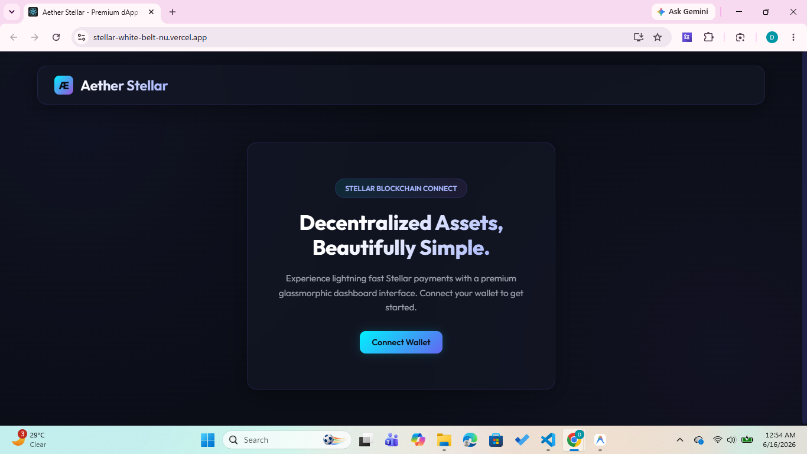
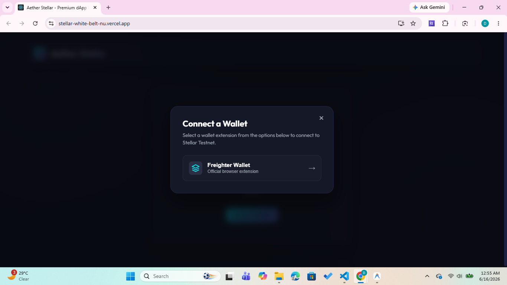
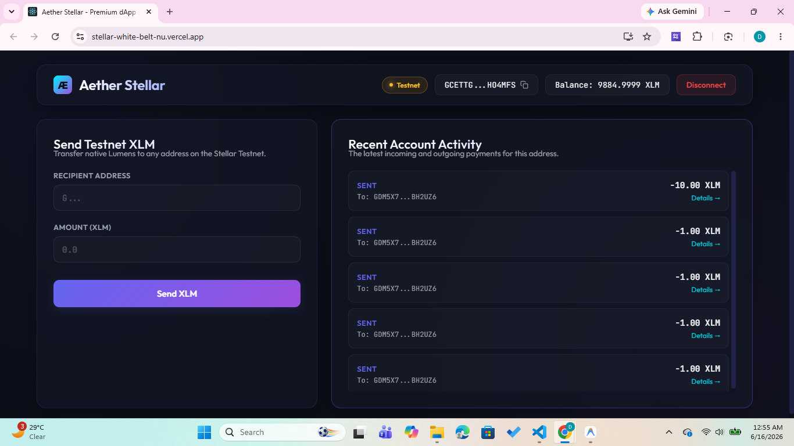
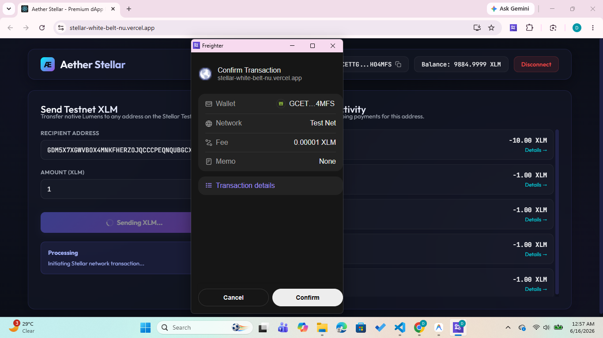
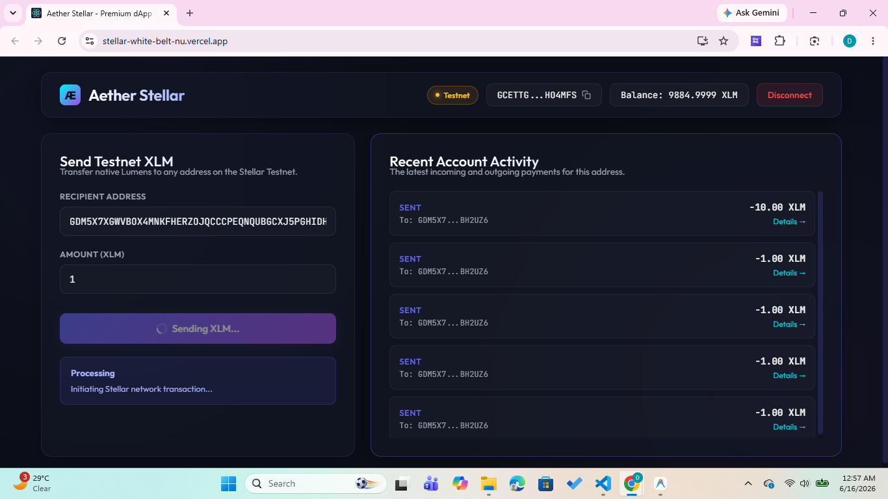
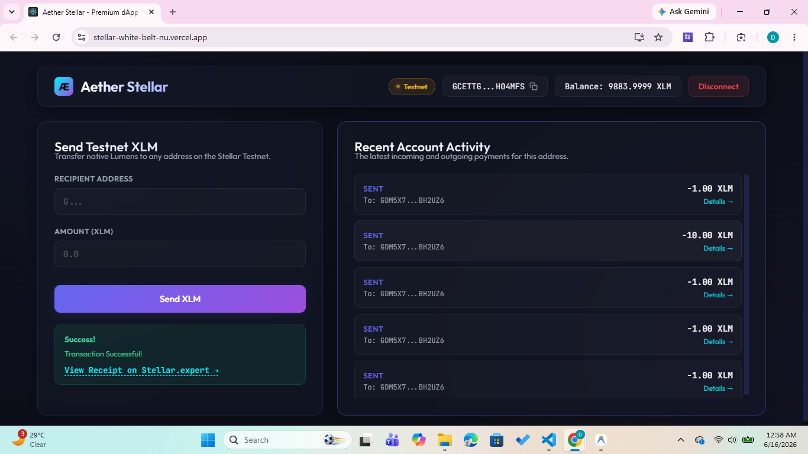
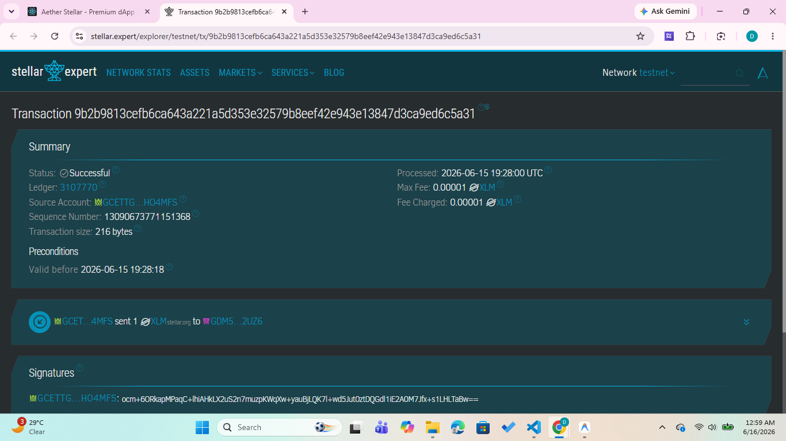

# Stellar White Belt Project

## Live Demo
https://stellar-white-belt-nu.vercel.app/

## GitHub Repository
https://github.com/AvipsaGanguly/stellar-white-belt

## Features

- Connect Freighter Wallet
- Display Stellar Testnet Account Balance
- Send Testnet XLM
- Freighter Transaction Signing
- Transaction Success Feedback
- Transaction History Panel
- Transaction Explorer Link
- Responsive Premium UI

---

## Screenshots

### 1. Landing Page

Shows the premium landing page before wallet connection.

---

### 2. Wallet Connection Modal

Freighter wallet selection popup.

---

### 3. Connected Dashboard

Wallet connected successfully with balance display and activity panel.

---

### 4. Transaction Confirmation

Freighter transaction approval popup.

---

### 5. Transaction Processing

Transaction submission in progress.

---

### 6. Successful Transaction

Successful transaction notification with Stellar Expert receipt link.

---

### 7. Transaction Hash Verification

Transaction verified on Stellar Expert Testnet Explorer.

## Tech Stack

- React.js
- Stellar SDK
- Freighter Wallet API
- Stellar Testnet
- Vercel Deployment

---

## Author

Avipsa Ganguly