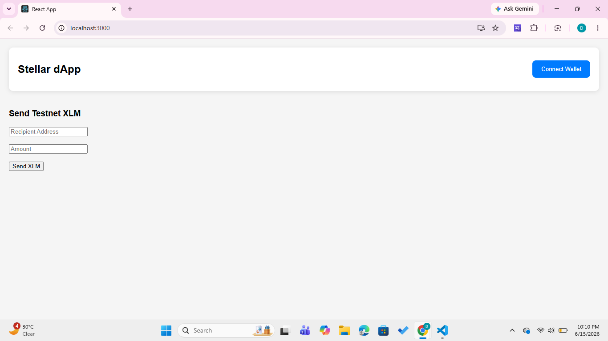
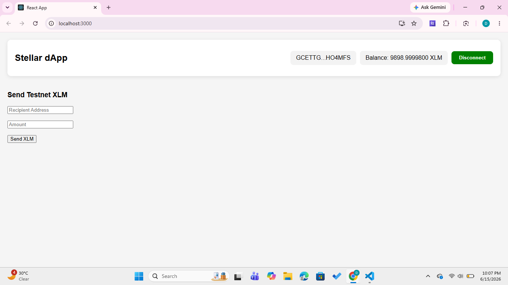
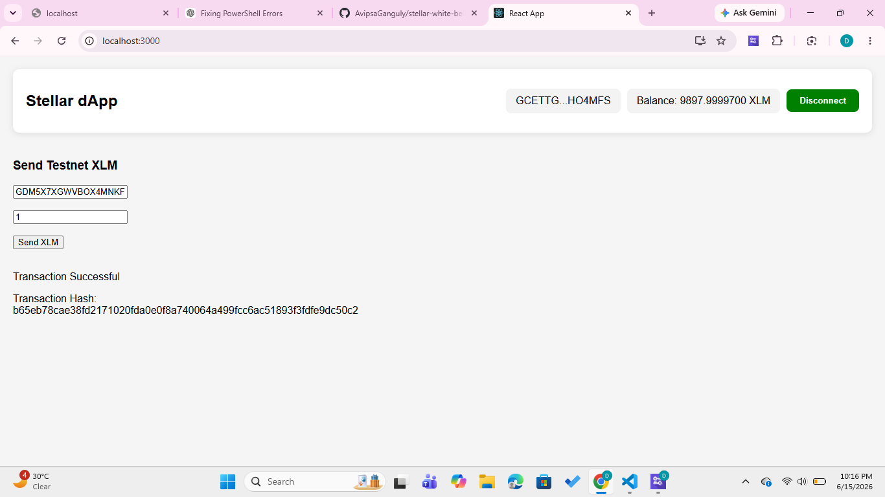

# Stellar White Belt Project

## Description

A Stellar Testnet dApp built using React and Freighter Wallet.

Features:
- Wallet Connect
- Wallet Disconnect
- Balance Display
- Send Testnet XLM
- Transaction Status
- Transaction Hash Display

## Setup Instructions

Clone repository:

```bash
git clone https://github.com/AvipsaGanguly/stellar-white-belt.git
```

Install dependencies:

```bash
npm install
```

Run project:

```bash
npm start
```

## Screenshots

### Wallet Connected



### Balance Display



### Successful Transaction


### Transaction Hash

